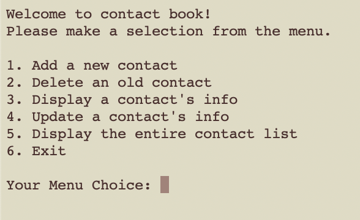

# Contact Book Application

**Description**

This Contact Book Application is a simple yet robust C++ program designed to manage contact information systematically. The application allows users to store, modify, and retrieve contact details such as names, phone numbers, and addresses.

**Features**

- Add New Contact: Insert new contact information into the contact book.

- Update Existing Contact: Modify existing contact details.

- Delete Contact: Remove contacts from the book.

- Search Contact: Retrieve contact details based on different criteria.

- List All Contacts: Display all stored contacts.
  
**Technologies**

- C++

- Object-oriented programming principles

## Getting Started

1. Clone this repository to your local machine.

2. Ensure you have a C++ compiler installed (e.g., g++, Clang).

3. Compile the program using the provided makefile or directly via command line:

```
g++ -o ContactBookApp *.cpp
```

4. Run the application:

```
./ContactBookApp
```

Once your application is running, it should look like this:

